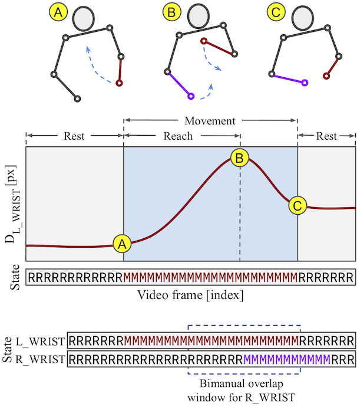
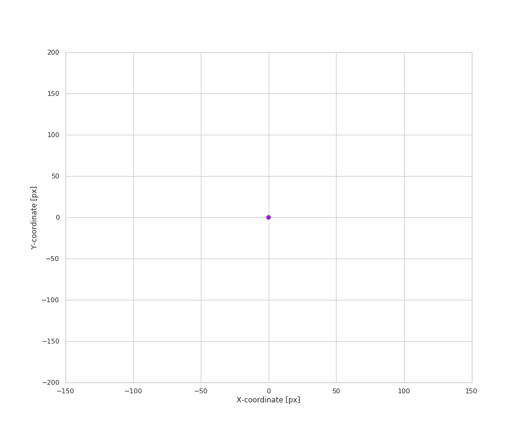

# Online supplement for: Mining naturalistic human behaviors in long-term video and neural recordings

* Preprint URL: [https://arxiv.org/abs/2001.08349](https://arxiv.org/abs/2001.08349)
* Accompanying data can be downloaded from [Google Drive](https://drive.google.com/drive/folders/1uKqwTB4Zpk-cRJ6UfPPiEG9N_AiXfJDy?usp=sharing) or [Figshare](https://figshare.com/articles/Minimal_zip/12509831) **Note: Google Drive files are publically accessible (no edit access required for downloading)**

BibTeX:
```
@article{singh2020towards,
  title={Mining naturalistic human behaviors in long-term video and neural recordings},
  author={Singh, Satpreet H and Peterson, Steven M and Rao, Rajesh PN and Brunton, Bingni W},
  journal={arXiv preprint arXiv:2001.08349},
  year={2020}
}
```

Please also see our follow-up pre-prints that use this data:
* On **neural encoding**: [Behavioral and neural variability of naturalistic arm movements](https://doi.org/10.1101/2020.04.17.047357)
* On **neural decoding**: [Generalized neural decoders for transfer learning across participants and recording modalities](https://doi.org/10.1101/2020.10.30.362558)


## Code set up
Instructions tested on an [Ubuntu 18.04](https://releases.ubuntu.com/18.04.4/) machine with [Anaconda Python 3](https://www.anaconda.com/products/individual):

* If you'd like, set up and activate a [virtual environment](https://docs.python.org/3/tutorial/venv.html). For example:
```bash
python -m venv /path/to/myvenv
source /path/to/myvenv/bin/activate
``` 
* Git clone this repository

* Install all requirements (with venv activated)
```bash
pip3 install -m requirements.txt
``` 

* Open notebook files using [Jupyter Notebook](https://jupyter-notebook.readthedocs.io/en/stable/) (this comes with your Anaconda installation)

* File summary (also see commments in each notebook or code file)
  * `ManuscriptEvents.ipynb`: This reproduces event counts, timestamps and metadata related plots
  * `ManuscriptDecoder.ipynb`: This reproduces neural decoding related plots
  * `config_paper.py`: Configuration & path information common to all code
  * Other files explained below

## Data set up
* Use URL at the top of this page to download files!

* Download and unzip them into the same folder, lets say `/path/to/datafolder`

* There are **three levels** of download possible, each corresponding to an increasingly larger file 

### 1: Minimal.zip
* Download and unzip `Minimal.zip`. This is the least you need to reproduce manuscript plots.
* Your folder structure should look like:
```
.
├── reports
│   ├── ...
├── ecog_metadata
│   ├── ecog_metadata_a0f66459.csv
│   ├── ecog_metadata_abdb496b.csv
│   ├── ...
└── events
    ├── events_a0f66459_l_wrist.csv
    ├── events_a0f66459_r_wrist.csv
    ├── events_abdb496b_l_wrist.csv
    ├── ...
```
* Edit `config_paper.py` in your `myvenv` folder and change the `DATA_DIR` variable to point to `/path/to/datafolder`
```
constants['DATA_DIR'] = '/path/to/datafolder/'
```
* Both `ManuscriptEvents.ipynb` and `ManuscriptDecoder.ipynb` should run right now, using pre-generated results
* See our other preprint for information about neural encoding: "Behavioral and neural variability of naturalistic arm movements" [https://doi.org/10.1101/2020.04.17.047357](https://doi.org/10.1101/2020.04.17.047357)


### 2: (1 +) MovementInitiationECoG.zip
* Downloading and unzipping this will add the following folders to your folder structure 
```
├── ecog_mvti_length
│   ├── a0f66459_1
│   ├── a0f66459_2
│   ├── a0f66459_3
│   ├── ...
```
* `decoder_cli_paper.py`: Use this to regenerate decoder results. See file for more information on running this script. View results using `ManuscriptDecoder.ipynb`.
* `Manuscript_ECoG_Event_Join.ipynb`: How to join event data with ECoG data for yoru own applications.
* `MovementInitiationECoG.zip.splitX` files on Figshare were created using the linux command `split -n 3 MovementInitiationECoG.zip`.


### 3: (2 +) EventLengthECoG.zip
* Downloading and unzipping this will add the following folders to your folder structure 
```
├── ecog_full_length
│   ├── a0f66459_1
│   ├── a0f66459_2
│   ├── a0f66459_3
│   ├── ...
```
* While the folder `ecog_mvti_length` contained ECoG neural data around time (+/- 0.5s) of movement initiation, the files in `ecog_full_length`  contain data for the entire length of the movement and an additional 0.5s at both start and the end. More specifically, the time spanned by this data is
  *  for movement events, 0.5s before movement initiation + time spanned by `run_1` (move state) frames and 0.5s after movement end.
  *  for rest events, 3s of continuous rest states.
* Unscrubbed and untested data; not used in this manuscript but provided to facilitate future research. 


***

## Event Metadata
This describes the event metadata found in `/path/to/datafolder/events/events_<patient_id>_<l|r>_wrist.csv`



### Metadata description from manuscript
For each detected movement event, we describe several metadata features from the continuous pose-dynamics associated with each movement event.
* This includes movement-associated metadata like the (x,y) *coordinates* of the keypoint at the start and end of the event, *duration* of the entire movement (up to next rest state), and *rest duration* before and after movement.
* Naturalistic hand movements are often made to reach out, touch or grab an object, then bring the hand back to the body. Therefore, we define the *reach* of a wrist movement to be its maximum radial displacement during the course of the event, as calculated from its location at the start of the event. We extract the *magnitude*, *angle*, and *duration*
for each reach.
* To measure the *shape* of a movement, we fit 1st, 2nd and 3rd-degree polynomials to a keypoint’s displacement trajectory.
* Differences between the quality of the fit (as measured by R^2) to each polynomial type provide a rough measure of the “curviness" of the movement trajectory. 
* We also estimate a movement’s onset and offset *speeds*, by calculating the keypoint’s displacement change within short time windows around the start and end of the movement.
* Since people often move both hands at the same time (i.e. “bimanually"), we annotate each of our wrist movement events with metadata about the opposing wrist’s movement, if any. By juxtaposing the discrete state sequence of both wrists, we calculate when the opposing hand starts to move (*lead/lag time difference*) and how long this movement overlaps with that of the primary hand (*overlap duration*).

### Additional notes

| column_name  | description  | 
|:-:|:-:|
| mvmt  | Can be 'l_wrist', 'r_wrist' or 'mv_0' for left/right wrist movement event, or rest  |
| day | Day of hospital stay  |
|'patient_id', 'subject_id'| Patient ID and Subject ID |
| event_timestamp  | Time event was detected |
| event_frame_idx, vid_name | video-name and frame index that event_timestamp corresponds to |
| 'ecog_start_idx_mvti', 'ecog_end_idx_mvti' | ECoG time-index for this event (around movement initiation). Use this to find the appropriate ECoG file for this event. |
| 'ecog_start_idx_full', 'ecog_end_idx_full' | ECoG time-index for this event (full length of event). Use this to find the appropriate ECoG file for this event. |
| ...  | ... |
| run_1 | number of frames that movement event lasted |
| run_01 | number of frames of rest before movement event started |
| run_10 | number of frames of rest after movement event ended |
| run_1_conf | average (pose-estimation) confidence score over run_1 |
|'start_x', 'start_y' and 'end_x', 'end_y'| (x,y) coordinates at start and end of movement |
|'reach_r', 'reach_a', reach_duration| Reach magnitude (in pixels), angle and duration (in frames) |
|'r2_poly1', 'r2_poly2', 'r2_poly3'| 1st, 2nd and 3rd degree polynomial fits to reach trajectory |
| ...  | ... |
|other_overlap_15pm, other_overlap_30pm | Opposing hand movement overlap in # frames, 15 or 30 frames +/- around primary hand event|
| bimanual | `df['bimanual'] = (df['other_overlap_15pm'] > 6) + 0` |
| ...  | ... |


<!-- Index(['Unnamed: 0', 'mvmt', 'day', '', 'event_timestamp',
       'time', '', 'run_01', 'run_01_conf', 'run_1_wconf', 'run_1',
       'run_10', 'run_10_conf', 'run_1_conf', 'start_x', 'start_y', 'end_x',
       'end_y', 'reach_r', 'reach_a', 'reach_avg_conf', 'reach_duration',
       'r2_poly1', 'r2_poly2', 'r2_poly3', 'shoulder_distance_mean',
       'shoulder_slope_mean', 'offset_velocity', 'onset_velocity',
       'other_lag_overlap', 'other_lag_overlap30', 'other_lead_lag',
       'other_lead_overlap30', 'other_overlap_15pm', 'other_overlap_30pm',
       'bimanual', 'ecog_start_idx_mvti', 'ecog_start_idx_full',
       'ecog_end_idx_mvti', 'ecog_end_idx_full', 'patient_id', 'subject_id'], -->

***

## Animation of naturalistic wrist trajectories 
* Speed: 1/3 X 
* Patient ID: abdb496b (Subject ID: S10)
* Side: R_wrist


***
## Conversion table between SubjectIDs (in paper) and PatientIDs (folder-name)
| SubjectID  | PatientID  | 
|:-:|:-:|
| S01 | a0f66459 |
| S02 | c95c1e82 |
| S03 | cb46fd46 |
| S04 | fcb01f7a |
| S05 | ffb52f92 |
| S06 | b4ac1726 |
| S07 | f3b79359 |
| S08 | ec761078 |
| S09 | f0bbc9a9 |
| S10 | abdb496b |
| S11 | ec168864 |
| S12 | b45e3f7b | 
| ...  | ... |
***

In case of questions, please [create an issue](https://help.github.com/en/github/managing-your-work-on-github/creating-an-issue) on this repository.
